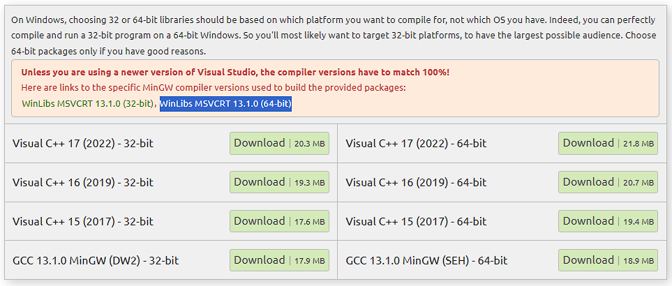
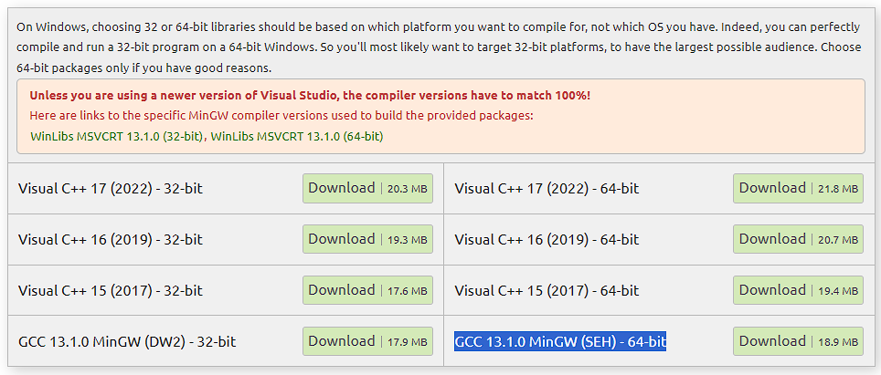

# DDoSimulator

## Organización de directorios

- `assets`: Almacena los recursos del juego (imágenes, texturas, audio, etc.)
- `bin`: Almacena los `.exe` que se generan al compilar
- `build`: Almacena los archivos `.o` que se generan en el pre-compilado
- `doc`: Almacena notas de desarrollo para guiarnos entre nosotros
- `include`: Almacena todos los encabezados `.hpp` (códigos que se utilizan con `#include`)
- `src`: Almacena el código como tal del juego
- `test`: Almacena códigos de testeo

## Configuración

Para poder usar SFML en vscode se necesita de un compilador. En este caso `g++`



y (obviamente) SFML



Descomprimir los archivos y mover la carpeta de `mingw64` y `SFML-2.6.1` donde quieran (preferiblemente en la raíz de algún disco)

Asignar en el archivo `c_cpp_properties` del directorio `.vscode` las rutas de dichas carpetas

En el caso de SFML, poner la ruta hasta `include`

```json
"includePath": [
    "${default}",
    "C:/SFML-2.6.1/include"
],
```

En el caso del compilador, poner la ruta de `g++.exe`

```json
"compilerPath": "C:/mingw64/bin/g++.exe"
```

## Compilación

En el archivo `Makefile` esta todo configurado, solo es cambiar nombres cuando sea necesario (dentro del mismo archivo hay comentarios explicativos)

- Antes de compilar tener en cuenta:
  - Usar **PowerShell** en vez de Git Bash
  - Cada que se quiera compilar luego de hacer cambios, se deben guardar dichos cambios
  - Todos los comandos se deben ejecutar estando en el directorio donde se encuentra el archivo `Makefile`

Para compilar se debe ejecutar en la terminal el comando `make`

```ps1
make
```

Para abrir el programa se ejecuta el `.exe` generado

```ps1
.\bin\main.exe
```

Para volver a compilar algo se recomienda ejecutar `make clean` para limpiar lo de la compilación anterior

```ps1
make clean
```

### Script

Como da pereza ejecutar a cada rato esos tres comandos hay un script en PowerShell que automatiza todo de forma segura, solo es ejecutar en la terminal el archivo `construir.ps1`

```ps1
.\construir.ps1
```

### Tests

Para ejecutar alguna prueba (los códigos del directorio `test`) simplemente se debe ejecutar en la terminal `make tester` (automáticamente se ejecuta el `.exe` generado)

```ps1
make tester
```

## .gitignore

En teoría no se debería subir al repositorio los directorios `.vscode`, `bin`, `build` y `test`. Eso cada uno lo trabaja de forma personal, pero pues se necesitan las carpetas y por eso todo esta comentado en el `.gitignore`, por lo tanto, quitar los comentarios una vez se este desarrollando
